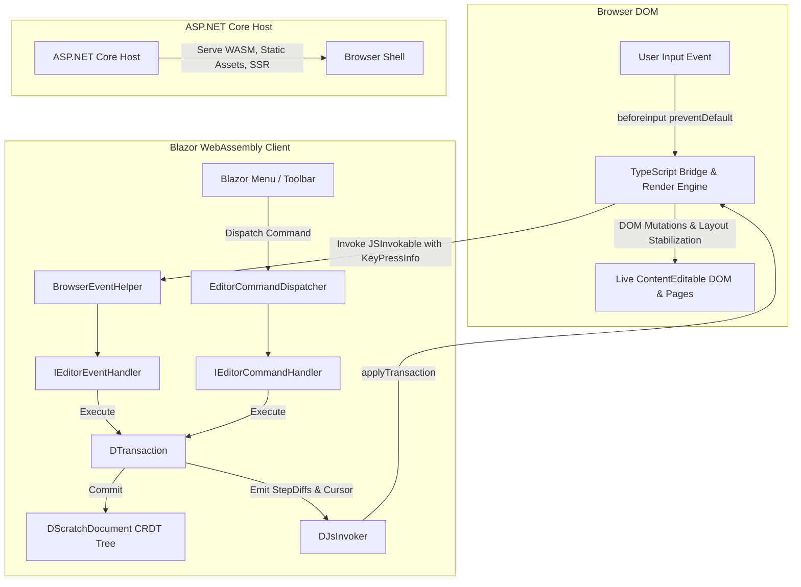

# DScratch — Agent Instructions & Architectural Guide

Welcome to **DScratch**. This document serves as the official project instructions for AI agents working in this repository.

---

## 1. Core Architecture & Division of Concerns

DScratch uses a **C#-Authoritative, Diff-Driven Model** with a **TypeScript Render Engine**:



### Component Boundaries

1. **Core Library (`src/DScratch`)**:
   - **Role**: The authoritative "brain" and logical source of truth.
   - **Responsibilities**: In-memory CRDT document tree ([`DScratchDocument`](file:///home/darki/Developement/DScratch/src/DScratch/DScratchDocument.cs)), relative ordering (`Origin`/`RightOrigin`), dual-indexed node lookup ([`CrdtLookupTable`](file:///home/darki/Developement/DScratch/src/DScratch/CrdtLookupTable.cs)), atomic transaction execution ([`DTransaction`](file:///home/darki/Developement/DScratch/src/DScratch/Transactions/DTransaction.cs)), mark computation, and minimal diff emission ([`StepDiff`](file:///home/darki/Developement/DScratch/src/DScratch/Transactions/StepDiff.cs)).
   - **Constraint**: Pure platform-agnostic C#. No dependencies on Blazor or browser DOM APIs.

2. **TypeScript Bridge & Render Engine (`src/DScratch.Client/BrowserInteractions/Scripts`)**:
   - **Role**: DOM mutation bridge, selection coordinator, and **physical layout & pagination engine**.
   - **Responsibilities**:
     - Intercepts `beforeinput` events and cancels browser mutations via `event.preventDefault()`.
     - Translates C# declarative `StepDiff` instructions into granular DOM mutations ([`transaction.ts`](file:///home/darki/Developement/DScratch/src/DScratch.Client/BrowserInteractions/Scripts/renderEngine/transaction.ts)).
     - **Physical Layout & Pagination ([`paging.ts`](file:///home/darki/Developement/DScratch/src/DScratch.Client/BrowserInteractions/Scripts/renderEngine/paging.ts))**: Calculates text wrapping, page height overflow (`aspect-ratio: 210/297`, 1080px A4 pages), binary-searches text split indices via `Range.getBoundingClientRect()`, manages multi-page split parts (`data-split-part="1"` and `"2"`), and merges adjacent split nodes.
     - **Selection & Caret Mapping ([`selection.ts`](file:///home/darki/Developement/DScratch/src/DScratch.Client/BrowserInteractions/Scripts/selection.ts))**: Translates native browser selections across split DOM parts to unified CRDT character offsets and safely restores carets across asynchronous WASM dispatch cycles.
   - **Constraint**: Always edit TypeScript source files in this folder. They are automatically bundled to `dist/editor.bundle.js` via `esbuild` during `dotnet build`. Never edit compiled bundle artifacts directly.

3. **Client UI & Interop (`src/DScratch.Client`)**:
   - **Role**: Blazor WebAssembly application shell.
   - **Responsibilities**: Toolbars, dropdown menus, formatting popovers, debug visualizer panels, and C# $\leftrightarrow$ JS interop event dispatching.

4. **ASP.NET Core Host (`src/DScratch.Host`)**:
   - **Role**: Host server, static asset delivery, and Server-Side Prerendering (SSR).

---

## 2. Directory Map

```
DScratch/
├── src/
│   ├── DScratch/                                       # C# CRDT Core & Transactions
│   ├── DScratch.Client/                                # Blazor WASM UI & Client Logic
│   │   └── BrowserInteractions/Scripts/                # TypeScript Render Engine & DOM Bridge
│   │       ├── editor.ts                               # Editor bridge initialization
│   │       ├── nodeHelper.ts                           # DOM traversal, split-part math & offsets
│   │       ├── selection.ts                            # Selection snapshotting & coordinate translation
│   │       ├── renderEngine/
│   │       │   ├── transaction.ts                      # StepDiff executor
│   │       │   ├── paging.ts                           # Physical layout & overflow splitting
│   │       │   └── renderEngineApi.ts                  # Public query API (node-to-page indexing)
│   │       └── tests/                                  # Vitest in-browser test suite
│   └── DScratch.Host/                                  # ASP.NET Core Host & Static Files
├── tests/
│   ├── DScratch.Tests/                                 # .NET Unit tests for CRDT & Transactions
│   └── DScratch.E2E/                                   # Playwright E2E browser automation tests
├── docs/
│   └── Architecture.md                                 # Full detailed architectural documentation
└── AGENTS.md                                           # This agent instruction file
```

---

## 3. Development & Testing Workflows

### Building the Project
* `dotnet build` — Compiles all .NET projects and automatically triggers `esbuild` to bundle TypeScript scripts.

### Running Tests
* **TypeScript Unit Tests (In-Browser Headless Chromium)**:
  - Run from `src/DScratch.Client/BrowserInteractions/Scripts`:
    - `npm test` — Executes all TypeScript tests headless.
    - `npx vitest` / `npm run test:watch` — Interactive watch mode.
    - `npm run test:ui` — Interactive Vitest UI runner for visual DOM inspection and step-by-step DevTools debugging.
    - `npx vitest run <path-to-test>` — Executes a specific test file.
* **.NET Core Unit Tests**:
  - `dotnet test tests/DScratch.Tests` — Runs fast, non-browser C# unit tests.
* **Playwright E2E Tests**:
  - `dotnet test tests/DScratch.E2E` — Executes full-stack Playwright browser tests against an auto-launched host server.
* **All .NET Tests**:
  - `dotnet test` — Runs both .NET unit tests and Playwright E2E tests.

---

## 4. Coding & Architecture Invariants

* **Do Not Move Layout Calculation into C#**: Physical text wrapping and DOM page splitting are strictly delegated to TypeScript and browser layout APIs. C# deals exclusively with logical nodes and CRDT clocks.
* **Preserve `data-dnode-id` and `data-split-part`**: When blocks split across pages in the DOM, both physical parts share the same logical `data-dnode-id` and are annotated with `data-split-part="1"` / `data-split-part="2"`.
* **C# Coding Standards**:
  - Use modern C# 12+ features (file-scoped namespaces, primary constructors, collection expressions).
  - Use `camelCase` for private fields (no underscore prefixes, e.g. `private int count;`).
  - Always `await` asynchronous calls and suffix methods with `Async`.
* **Deep Architectural Reference**:
  - For full sequence diagrams, CRDT clock mathematics, and StepDiff protocols, refer to [`docs/Architecture.md`](file:///home/darki/Developement/DScratch/docs/Architecture.md).
