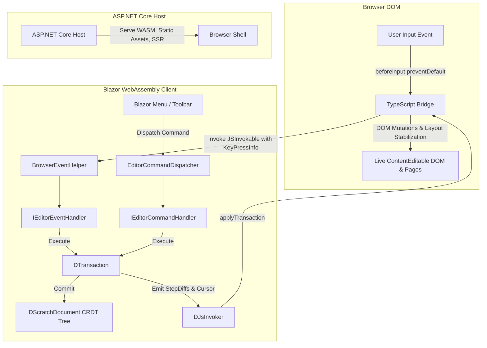
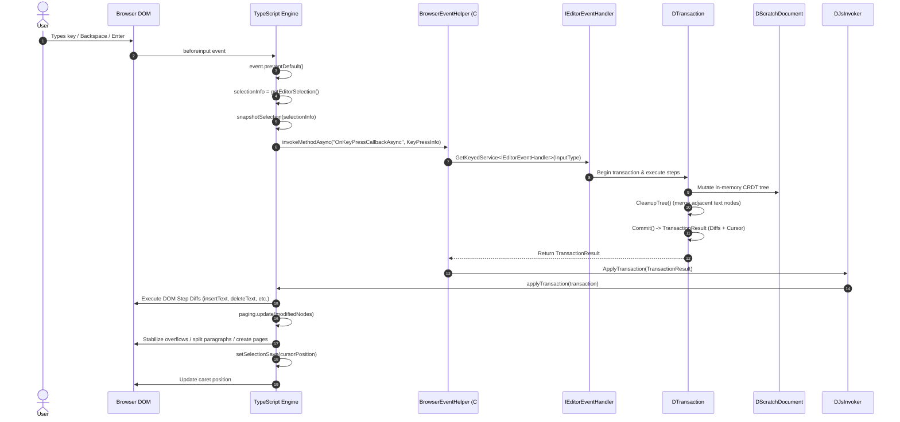
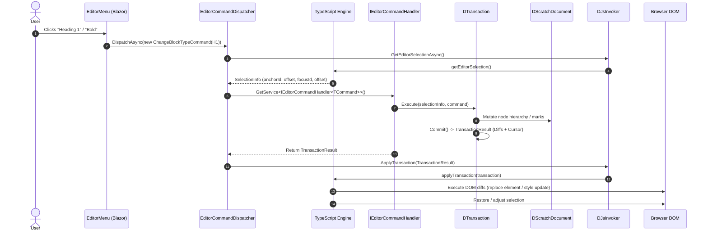
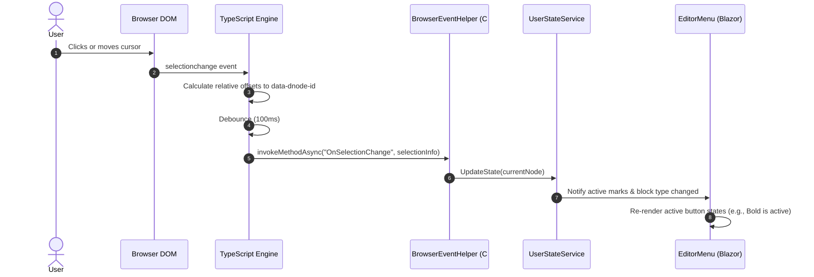
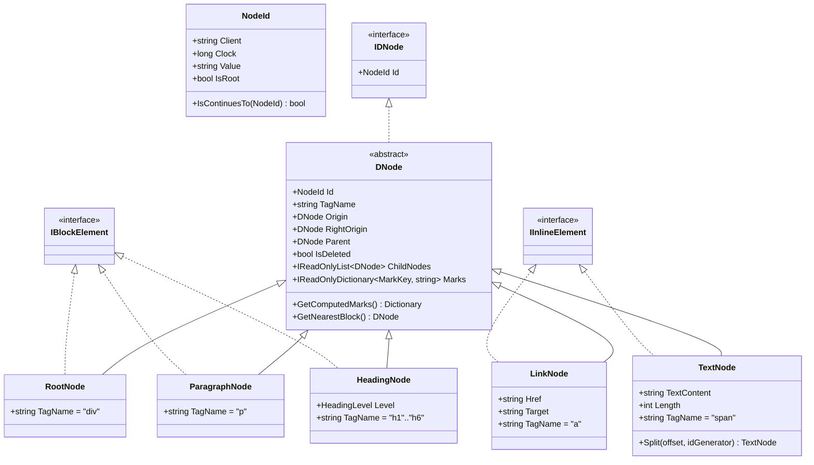
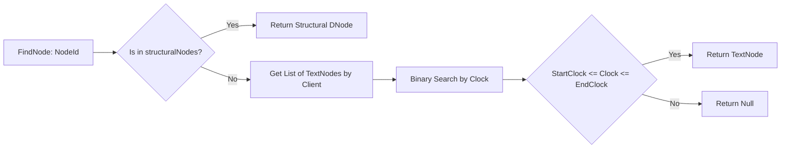
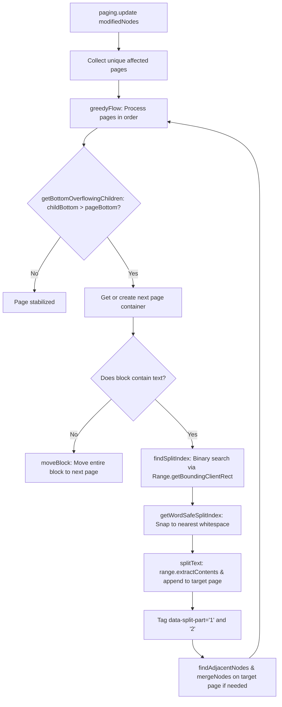
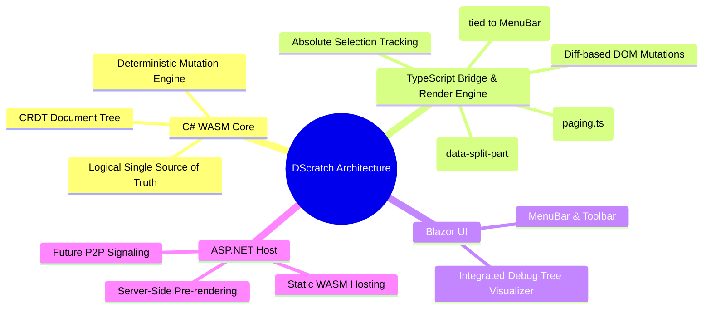

# DScratch Architecture

**DScratch** is a high-performance, rich-text web editor built with **.NET Blazor WebAssembly**, **C# CRDT Core**, and a specialized **TypeScript DOM Bridge**.

This document outlines the architectural philosophy, component topology, data pipelines, document model, transaction engine, and DOM synchronization protocol.

---

## 1. Architectural Philosophy

Traditional rich-text editors built with browser-native `contenteditable` suffer from browser inconsistencies, unpredictable DOM mutations, and complex undo/redo management. Conversely, re-rendering an entire editor canvas via Blazor WebAssembly components causes severe latency, cursor flicker, and loss of native IME/selection capabilities.

DScratch solves this with a **C#-Authoritative, Diff-Driven Model**:

- **C# as the Single Source of Truth**: The C# WASM layer holds an in-memory Conflict-Free Replicated Data Type (CRDT) document tree, executes formatting/structural logic, and enforces all document invariants.
- **Controlled `contenteditable`**: The browser's native mutation engine is completely intercepted via `beforeinput` (`event.preventDefault()`), preventing arbitrary DOM alterations by the browser.
- **Atomic Diff Synchronization**: C# computes minimal, declarative `StepDiff` instructions that a lightweight TypeScript bridge applies to the live DOM.
- **TypeScript-Owned Physical Layout & Pagination**: Document pagination, text wrapping, and page-overflow splitting depend on browser-native font metrics and the CSS box model (`getBoundingClientRect()`). TypeScript owns physical layout stabilization, dynamic page creation, and multi-page node splitting while C# remains strictly authoritative over logical content.
- **Accurate Selection Preservation**: Custom coordinate mapping translates DOM ranges across split page parts to stable CRDT node offsets and restores caret positions seamlessly across asynchronous event loops.



---

## 2. System Topology

The solution is divided into three primary projects alongside client-side TypeScript modules:

```
DScratch/
├── src/
│   ├── DScratch/            # Core CRDT Document Model, Transactions, & Interactions (Platform Agnostic)
│   ├── DScratch.Client/     # Blazor WebAssembly UI, Components, JSInterop Bridge, & TypeScript scripts
│   └── DScratch.Host/       # ASP.NET Core Server (Static file hosting, SSR, Endpoint routing)
├── tests/
│   ├── DScratch.Tests/      # Unit tests for CRDT, TreeWalker, and Transactions
│   └── DScratch.E2E/        # Playwright end-to-end browser automation tests
└── docs/
    └── Architecture.md      # This document
```

### Component Responsibility Matrix

| Component | Technology | Responsibilities | Key Types / Modules |
| :--- | :--- | :--- | :--- |
| **DScratch Core** | .NET 9 Standard | Document CRDT representation, tree walking, node indexing, transaction execution, mark calculation, and cleanup logic. | [`DScratchDocument`](file:///home/darki/Developement/DScratch/src/DScratch/DScratchDocument.cs), [`CrdtLookupTable`](file:///home/darki/Developement/DScratch/src/DScratch/CrdtLookupTable.cs), [`DTransaction`](file:///home/darki/Developement/DScratch/src/DScratch/Transactions/DTransaction.cs), [`StepDiff`](file:///home/darki/Developement/DScratch/src/DScratch/Transactions/StepDiff.cs) |
| **DScratch Client** | Blazor WASM | UI chrome, toolbars, format buttons, popovers, debug panels, and C# $\leftrightarrow$ JS interop dispatching. | [`BrowserEventHelper`](file:///home/darki/Developement/DScratch/src/DScratch.Client/BrowserInteractions/BrowserEventHelper.cs), [`EditorCommandDispatcher`](file:///home/darki/Developement/DScratch/src/DScratch.Client/BrowserInteractions/EditorCommandDispatcher.cs), [`DJsInvoker`](file:///home/darki/Developement/DScratch/src/DScratch.Client/BrowserInteractions/DJsInvoker.cs) |
| **TypeScript Bridge & Render Engine** | TypeScript (ESBuild) | `beforeinput` interception, StepDiff execution, **physical page layout & overflow splitting**, Selection $\leftrightarrow$ CRDT coordinate mapping, CSS highlight overlays. | [`editor.ts`](file:///home/darki/Developement/DScratch/src/DScratch.Client/BrowserInteractions/Scripts/editor.ts), [`paging.ts`](file:///home/darki/Developement/DScratch/src/DScratch.Client/BrowserInteractions/Scripts/renderEngine/paging.ts), [`transaction.ts`](file:///home/darki/Developement/DScratch/src/DScratch.Client/BrowserInteractions/Scripts/renderEngine/transaction.ts), [`selection.ts`](file:///home/darki/Developement/DScratch/src/DScratch.Client/BrowserInteractions/Scripts/selection.ts), [`inputs.ts`](file:///home/darki/Developement/DScratch/src/DScratch.Client/BrowserInteractions/Scripts/userInteraction/inputs.ts) |
| **ASP.NET Core Host** | ASP.NET Core | Host pipeline, static asset delivery, server-side pre-rendering (SSR), health checks (`/health`), and future P2P signaling. | [`Program.cs`](file:///home/darki/Developement/DScratch/src/DScratch.Host/Program.cs), [`App.razor`](file:///home/darki/Developement/DScratch/src/DScratch.Host/Components/App.razor) |

---

## 3. Core Execution Lifecycles

### 3.1 Flow 1: User Input Event Lifecycle

When a user types, presses Enter, or deletes text inside the editor, the browser generates an input event. The system handles it via the following cycle:



> [!NOTE]
> By calling `event.preventDefault()` immediately in `beforeinput`, native browser mutation is cancelled. The DOM is updated strictly when TypeScript receives the validated diffs from C#, followed immediately by client-side pagination stabilization (`paging.update`).

---

### 3.2 Flow 2: UI Menu Command Lifecycle

When a user triggers an action from the UI menu (e.g. toggling Bold, changing a paragraph to a Heading, or adding a link):



---

### 3.3 Flow 3: Real-Time Selection & User State Synchronization

When the user moves the cursor or changes selection via mouse or arrow keys:



---

## 4. Document Model & CRDT Architecture

DScratch represents the document as a hierarchical tree of nodes identified by unique **CRDT Clock IDs**.



### 4.1 Node Identification (`NodeId`)
Each node has a globally unique, immutable identifier formatted as `"{Client}-{Clock}"` (e.g., `"clientA-1024"`). The root node is a designated singleton (`"Root"`).
- **`Client`**: Unique identifier for the client session or peer.
- **`Clock`**: Monotonically increasing Lamport clock assigned by [`INodeIdGenerator`](file:///home/darki/Developement/DScratch/src/DScratch/INodeIdGenerator.cs).
- **`IsContinuesTo`**: Checks if two nodes are consecutive within the same client session, enabling character run optimizations.

### 4.2 CRDT Relative Ordering
Nodes store `Origin` (left sibling) and `RightOrigin` (right sibling) references at creation time. This allows deterministic, conflict-free relative positioning even under concurrent insertions.

### 4.3 Dual-Indexed Lookup Table (`CrdtLookupTable`)
High performance is guaranteed through a specialized two-tier indexing strategy in [`CrdtLookupTable.cs`](file:///home/darki/Developement/DScratch/src/DScratch/CrdtLookupTable.cs):



1. **Structural Elements** ($O(1)$ lookup):
   `Dictionary<NodeId, DNode>` stores paragraphs, headings, containers, and wrappers.
2. **Text Runs** ($O(\log N)$ lookup):
   `Dictionary<string, List<TextNode>>` groups text nodes by client ID, sorted by clock. Since text nodes represent continuous character ranges (`[Clock .. Clock + Length - 1]`), binary search locates the exact character node in logarithmic time.

---

## 5. Transaction Engine & StepDiff Protocol

All document mutations occur inside an atomic transaction ([`DTransaction`](file:///home/darki/Developement/DScratch/src/DScratch/Transactions/DTransaction.cs)).

### 5.1 Internal Steps (`IStep`)
Internal steps represent semantic mutations executed against the C# document tree:
- **`InsertStep`**: Adds a new block, inline element, or text node relative to its origin.
- **`DeleteStep`**: Marks a node as deleted (CRDT tombstone) and detaches it from active child collections.
- **`DeleteRangeStep`**: Multi-node deletion across selection boundaries.
- **`MoveRangeStep`**: Re-parents or re-orders a sequence of nodes.
- **`ReplaceNodeStep`**: Converts a node to a different type (e.g., transforming `<p>` to `<h2>`).
- **`UpdateMarkStep`**: Modifies inline style dictionaries (bold, italic, color).
- **`UpdateAttributeStep`**: Updates HTML attributes (e.g., `href`, `target`).

### 5.2 StepDiff Protocol (C# $\rightarrow$ Browser JSON)

When committed, the transaction translates all internal steps and tree cleanups into minimal, serializable [`StepDiff`](file:///home/darki/Developement/DScratch/src/DScratch/Transactions/StepDiff.cs) objects:

| Diff Type (`type`) | Payload Properties | TypeScript DOM Handler Action                                                                                         |
| :--- | :--- |:----------------------------------------------------------------------------------------------------------------------|
| `insertText` | `parentId`, `offset`, `text` | Finds parent element, traverses to text node at offset, and inserts text or creates text child.                       |
| `deleteText` | `parentId`, `offset`, `length` | Slices text range out of DOM text node at the given offset.                                                           |
| `insertElement` | `parentId`, `previousSiblingId`, `tagName`, `newNodeId`, `attributes` | Creates DOM element with `data-dnode-id="newNodeId"`, sets attributes, and after before `previousSibling`.            |
| `deleteElement` | `targetId` | Calls `.remove()` on `[data-dnode-id="targetId"]`.                                                                    |
| `move` | `targetNodeId`, `targetParentId`, `previousSiblingId` | Re-inserts existing DOM element under target parent.                                                                  |
| `updateMarks` | `nodeId`, `marks` | Clears and updates inline CSS style attributes on the target element.                                                 |
| `updateAttributes` | `nodeId`, `attributes` | Synchronizes HTML attributes (`href`, `target`, etc.) while preserving `data-dnode-id`.                               |

### 5.3 Tree Cleanup & Text Coalescing
After executing steps, [`CleanUpHelper.cs`](file:///home/darki/Developement/DScratch/src/DScratch/Transactions/CleanUpHelper.cs) scans modified text nodes:
- Adjacent text nodes with the same marks, parent, and contiguous origin are merged into a single `TextNode`.
- Corresponding `deleteText` + `insertText` diffs are emitted to seamlessly coalesce DOM text nodes and prevent DOM fragmentation.

---

## 6. Browser Layer & Selection Management

The browser client interacts with the DOM using a dedicated TypeScript engine located in `src/DScratch.Client/BrowserInteractions/Scripts/`.

```
Scripts/
├── editor.ts               # Editor initialization and global window.editor bridge
├── nodeHelper.ts           # DOM lookup by data-dnode-id, split-part resolution, text offset math
├── selection.ts            # Selection snapshotting, coordinate translation, fake selection
├── editorMenu.ts           # Popovers (Link adding/editing) & CSS Anchor Positioning
├── renderEngine/
│   ├── transaction.ts      # StepDiff execution against the DOM
│   ├── paging.ts           # Document layout, pagination, overflow detection & text splitting
│   └── renderEngineApi.ts  # Public render engine queries (node-to-page indexing)
└── userInteraction/
    ├── inputs.ts           # beforeinput listener and inputType dispatcher
    └── links.ts            # Anchor element click handling
```

### 6.1 DOM Representation
Every managed DOM element contains a `data-dnode-id` attribute matching its CRDT `NodeId`. When blocks span across page boundaries, they are tagged with `data-split-part`:

```html
<div id="doc-editor">
    <!-- Page 1 -->
    <div class="page" data-page-index="1">
        <div data-dnode-id="Root" contenteditable="">
            <p data-dnode-id="client1-100" data-split-part="1">
                <span data-dnode-id="client1-101">Welcome to DScratch! This paragraph starts on page 1 </span>
            </p>
        </div>
    </div>
    <!-- Page 2 -->
    <div class="page" data-page-index="2">
        <div data-dnode-id="Root" contenteditable="">
            <p data-dnode-id="client1-100" data-split-part="2">
                <span data-dnode-id="client1-101">and seamlessly continues onto page 2.</span>
            </p>
        </div>
    </div>
</div>
```

### 6.2 Selection & Caret Synchronization
Handling selection during asynchronous WASM round-trips is critical:
1. **DOM $\rightarrow$ SelectionInfo**: [`getEditorSelection()`](file:///home/darki/Developement/DScratch/src/DScratch.Client/BrowserInteractions/Scripts/selection.ts) inspects `window.getSelection()`, identifies the enclosing `[data-dnode-id]` elements, and computes character offsets relative to the node boundary. For nodes in `data-split-part="2"`, it adds the text length of `data-split-part="1"` to compute unified absolute offsets.
2. **Snapshotting**: When an input event starts, [`snapshotSelection()`](file:///home/darki/Developement/DScratch/src/DScratch.Client/BrowserInteractions/Scripts/selection.ts) saves the caret position.
3. **Safe Restoration**: In [`setSelectionSave()`](file:///home/darki/Developement/DScratch/src/DScratch.Client/BrowserInteractions/Scripts/selection.ts), when C# returns the updated cursor position, TypeScript checks if the user has moved their selection natively during the C# computation. If not, it translates absolute offsets across split parts via [`findTextNodeAtOffset()`](file:///home/darki/Developement/DScratch/src/DScratch.Client/BrowserInteractions/Scripts/nodeHelper.ts) and applies the range.

### 6.3 Layout & Pagination Engine (`paging.ts`)

A key architectural distinction in DScratch is that **C# is responsible for the logical document tree, while TypeScript is responsible for physical page layout and pagination**.

#### Why Layout Belongs in TypeScript
- **Browser-Native Geometry**: Accurate text wrapping, line breaking, font metrics, and box dimensions (`aspect-ratio: 210/297`, `1080px` A4 pages) are computed directly by the browser's layout engine.
- **Pure Logical Model in C#**: Keeping physical page geometry out of C# ensures the CRDT data model remains clean, lightweight, and decoupled from headless browser layout emulation.

#### Pagination & Overflow Flow (`greedyFlow`)
Whenever a transaction mutates the DOM, `paging.update(modifiedNodes)` scans the affected `.page[data-page-index]` containers:



#### Key Layout Mechanisms
1. **Overflow Detection (`getBottomOverflowingChildren`)**:
   Calculates `pageBottom = pageContentRect.bottom - paddingBottom` against the bottom bound of the last child block (`childBottom = lastBlock.bottom + marginBottom`).
2. **Binary Search Text Splitting (`findSplitIndex` & `splitText`)**:
   When a paragraph overflows across the bottom edge of a page, a binary search creates sub-ranges using `document.createRange()` to locate the exact character offset that fits. `getWordSafeSplitIndex` ensures words are never split mid-token.
3. **Virtual Split Parts (`data-split-part`)**:
   When a paragraph splits across pages:
   - Part 1 on page $N$ is tagged with `data-split-part="1"`.
   - Part 2 on page $N+1$ is tagged with `data-split-part="2"`.
   - Both DOM elements maintain the exact same `data-dnode-id`.
   - `nodeHelper.ts` and `selection.ts` calculate absolute offsets by accumulating `counterPart.textContent.length`, ensuring continuous character coordinates across page splits.
4. **Adjacent Node Merging (`findAdjacentNodes` & `mergeNodes`)**:
   When deletions or reverse edits cause text to pull back or merge on a page, adjacent split nodes with matching `data-dnode-id` attributes are coalesced into a single element.
5. **Dynamic Page Lifecycle (`createPage`)**:
   New pages are dynamically cloned from `<template id="page-template">`, stamped with `data-page-index`, and inserted into `#doc-editor`.

---

## 7. ASP.NET Core Hosting & Pre-rendering

[`DScratch.Host`](file:///home/darki/Developement/DScratch/src/DScratch.Host/Program.cs) serves as the host application:
- **Interactive WebAssembly with SSR**: Blazor renders the initial shell on the server before client-side WebAssembly takes over.
- **Static Asset Optimization**: Delivers compiled WASM binaries, CSS design tokens (`editor-tokens.css`, `document-styles.css`), and bundled JavaScript (`editor.bundle.js`).
- **P2P Collaboration Hub (Roadmap)**: Designed to host WebRTC signaling and peer discovery for distributed, multi-user document collaboration.

---

## 8. Summary of Benefits

