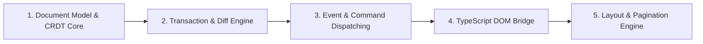

# DScratch Codebase & Architectural Review

This document contains the comprehensive, multi-layer code and architectural review of the **DScratch** repository. It outlines key findings, architectural considerations, and structural questions across the C# CRDT Core, Transaction Engine, Event Dispatching, TypeScript DOM Bridge, and Layout/Pagination Engine.

---

## 1. Review Structure & Methodology

The review inspects the system along the end-to-end data flow and boundary transitions:



---

## 2. Document Model & CRDT Core

### 2.1 Dictionary State Mutation on Node Removal
* **File**: [`src/DScratch/CrdtLookupTable.cs`](file:///home/darki/Developement/DScratch/src/DScratch/CrdtLookupTable.cs#L76-L95)
* **Finding**:
  In [`CrdtLookupTable.Remove`](file:///home/darki/Developement/DScratch/src/DScratch/CrdtLookupTable.cs#L76-L95), when looking up `nodesByClient` by client ID, if `TryGetValue` returns `false`, a new list containing the removed node is instantiated and assigned:
  ```csharp
  if (!nodesByClient.TryGetValue(node.Id.Client, out var nodes))
  {
      nodesByClient[node.Id.Client] = [textNode];
      return;
  }
  ```
* **Points to Consider**:
  - Why should removing a non-existent client entry allocate and insert a new bucket containing the target node?
  - What happens if a subsequent lookup binary-searches inside this newly populated client list?

---

### 2.2 Dual-Filter Sibling Traversal in `TreeWalker`
* **File**: [`src/DScratch/TreeWalker.cs`](file:///home/darki/Developement/DScratch/src/DScratch/TreeWalker.cs#L125-L146)
* **Finding**:
  In [`TreeWalker<TFilter1, TFilter2>.NextSibling()`](file:///home/darki/Developement/DScratch/src/DScratch/TreeWalker.cs#L125-L146), the switch statement's `default` branch assigns:
  ```csharp
  default:
      next = Current?.RightOrigin;
      break;
  ```
* **Points to Consider**:
  - `Current` is only reassigned when a match succeeds (`Current = next`). If the first sibling does not match `TFilter1` or `TFilter2`, `Current` remains unchanged.
  - On the next loop iteration, `next` is re-evaluated to `Current?.RightOrigin` rather than advancing forward along the sibling chain (`next.RightOrigin`).
  - Compare this loop advance with the single-filter implementation in [`TreeWalker<TFilter>.NextSibling()`](file:///home/darki/Developement/DScratch/src/DScratch/TreeWalker.cs#L51-L68).

---

### 2.3 Tombstones vs. Structural Node Unlinking
* **File**: [`src/DScratch/Nodes/DNode.cs`](file:///home/darki/Developement/DScratch/src/DScratch/Nodes/DNode.cs#L36-L57)
* **Finding**:
  There is a distinction between [`DNode.Delete()`](file:///home/darki/Developement/DScratch/src/DScratch/Nodes/DNode.cs#L53-L57) (marking `IsDeleted = true` while preserving structural relationships) and [`DNode.Remove()`](file:///home/darki/Developement/DScratch/src/DScratch/Nodes/DNode.cs#L36-L45) (which clears `Origin`, `RightOrigin`, and unlinks from `Parent`).
* **Points to Consider**:
  - In a CRDT graph where concurrent insertions rely on `Origin` and `RightOrigin` for deterministic relative placement, what happens if concurrent operations reference a node that was unlinked rather than marked as a tombstone?
  - When is it safe to prune nodes completely versus retaining tombstones for synchronization?

---

## 3. Transaction Engine & StepDiff Protocol

### 3.1 ~~StepDiff Staging Order in Atomic Transactions~~ (added to TODO)
* **File**: [`src/DScratch/Transactions/DTransaction.cs`](file:///home/darki/Developement/DScratch/src/DScratch/Transactions/DTransaction.cs#L32-L45)
* **Finding**:
  In [`DTransaction.Commit()`](file:///home/darki/Developement/DScratch/src/DScratch/Transactions/DTransaction.cs#L32-L45), StepDiffs are aggregated in the following order:
  ```csharp
  stepDiffs = [..additionalStepDiffs, ..stepDiffs, ..cleanUpSteps];
  ```
  `additionalStepDiffs` captures diffs emitted during inline helpers (e.g. [`SplitText`](file:///home/darki/Developement/DScratch/src/DScratch/Transactions/DTransaction.cs#L100-L112)) that occur during step execution.
* **Points to Consider**:
  - Because `additionalStepDiffs` is prepended before the main `stepDiffs`, those DOM mutations are dispatched to the browser first.
  - Could a scenario arise where an element is split or modified before its containing block is inserted or moved by a preceding logical step?

---

### 3.2 Selection Offset Calculation During Node Coalescing
* **File**: [`src/DScratch/Transactions/CleanUpHelper.cs`](file:///home/darki/Developement/DScratch/src/DScratch/Transactions/CleanUpHelper.cs#L62-L71)
* **Finding**:
  In [`CleanUpHelper.AdjustSelection`](file:///home/darki/Developement/DScratch/src/DScratch/Transactions/CleanUpHelper.cs#L36-L74), when updating a selection range whose focus ends in the merged node:
  ```csharp
  if (selectionInfo.AnchorId != oldNode.Id.Value && selectionInfo.FocusId == oldNode.Id.Value)
  {
      return new SelectionInfo
      {
          AnchorId = selectionInfo.AnchorId,
          AnchorOffset = selectionInfo.AnchorOffset,
          FocusId = targetNode.Id.Value,
          FocusOffset = targetNode.Length + selectionInfo.AnchorOffset
      };
  }
  ```
* **Points to Consider**:
  - Notice that line 69 calculates `FocusOffset` by adding `selectionInfo.AnchorOffset` rather than `selectionInfo.FocusOffset`.
  - For range selections spanning multiple nodes where the focus lands in a merged node, how does this affect the restored caret selection?

---

### 3.3 Linear Sibling Traversal in Cross-Block Range Operations
* **File**: [`src/DScratch/Transactions/Steps/DeleteRangeStep.cs`](file:///home/darki/Developement/DScratch/src/DScratch/Transactions/Steps/DeleteRangeStep.cs#L38-L53), [`src/DScratch/Transactions/Steps/MoveRangeStep.cs`](file:///home/darki/Developement/DScratch/src/DScratch/Transactions/Steps/MoveRangeStep.cs#L80-L107)
* **Finding**:
  [`DeleteRangeStep`](file:///home/darki/Developement/DScratch/src/DScratch/Transactions/Steps/DeleteRangeStep.cs) and [`MoveRangeStep`](file:///home/darki/Developement/DScratch/src/DScratch/Transactions/Steps/MoveRangeStep.cs) iterate from `start` to `end` using `current = current.RightOrigin`.
* **Points to Consider**:
  - `RightOrigin` defines sibling relationships within the same branch.
  - If a range deletion starts inside a child node of Block 1 and ends inside a child node of Block 2, `current.RightOrigin` will not bridge the gap between distinct parent blocks.

---

## 4. Interactions & Event Handling

### 4.1 Selection Endpoint Type Assumptions
* **File**: [`src/DScratch/Interactions/EventHandlers/Common/DeleteSelection.cs`](file:///home/darki/Developement/DScratch/src/DScratch/Interactions/EventHandlers/Common/DeleteSelection.cs#L24-L27), [`src/DScratch/Interactions/CommandHandlers/Handlers/UpdateMarkHandler.cs`](file:///home/darki/Developement/DScratch/src/DScratch/Interactions/CommandHandlers/Handlers/UpdateMarkHandler.cs#L66-L69)
* **Finding**:
  [`DeleteSelection.SearchSelectedNodes`](file:///home/darki/Developement/DScratch/src/DScratch/Interactions/EventHandlers/Common/DeleteSelection.cs#L17-L32) and [`UpdateMarkHandler.GetSelectedNodes`](file:///home/darki/Developement/DScratch/src/DScratch/Interactions/CommandHandlers/Handlers/UpdateMarkHandler.cs#L54-L99) throw an `ArgumentException` if either `origin` or `rightOrigin` is not a [`TextNode`](file:///home/darki/Developement/DScratch/src/DScratch/Nodes/TextNode.cs).
* **Points to Consider**:
  - When dragging a mouse selection across empty paragraphs, headings, or link boundaries, the native browser selection endpoints often resolve to block elements or container wrappers rather than leaf text nodes.
  - How should the selection search helper locate or normalize nearest text nodes before asserting node types?

---

### 4.2 Selection Boundary Invariants
* **Context & Architectural Notes**:
  - **Root Boundary Filtering** ([`BrowserEventHelper.cs#L20`](file:///home/darki/Developement/DScratch/src/DScratch.Client/BrowserInteractions/BrowserEventHelper.cs#L20), [`EditorCommandDispatcher.cs#L17`](file:///home/darki/Developement/DScratch/src/DScratch.Client/BrowserInteractions/EditorCommandDispatcher.cs#L17)): By design, editable interactions operate strictly within child block/inline nodes; events targeting `Root` are intentionally bypassed.
  - **Menu Focus Preservation** ([`UserStateService.cs#L46-L51`](file:///home/darki/Developement/DScratch/src/DScratch/Interactions/UserStates/UserStateService.cs#L46-L51)): Toolbar and menu buttons use `preventDefault` on mousedown, ensuring browser focus does not leave the editor canvas and preserving pending marks until typed.

---

## 5. TypeScript DOM Bridge & Caret Mapping

### 5.1 Caret Placement on Editor Click
* **File**: [`src/DScratch.Client/BrowserInteractions/Scripts/editor.ts`](file:///home/darki/Developement/DScratch/src/DScratch.Client/BrowserInteractions/Scripts/editor.ts#L48-L68)
* **Finding**:
  In [`setCursorToEnd`](file:///home/darki/Developement/DScratch/src/DScratch.Client/BrowserInteractions/Scripts/editor.ts#L48-L68):
  ```typescript
  const lastParagraph = element.querySelector<HTMLElement>("p:last-of-type")!;
  if (!lastParagraph) return;
  
  const textNode = lastParagraph.firstChild || lastParagraph;
  const offset = textNode.nodeType === Node.TEXT_NODE
      ? (textNode.textContent?.length || 0)
      : 0;
  ```
* **Points to Consider**:
  - If the document ends with a heading (`<h1>`..`<h6>`) instead of a `<p>`, `p:last-of-type` will not match the last block.
  - In DScratch, paragraph children are typically `<span>` elements (`Node.ELEMENT_NODE`) wrapping text. If `lastParagraph.firstChild` is a `<span>`, `textNode.nodeType === Node.TEXT_NODE` evaluates to `false`, collapsing the offset to `0` (the start of the element).

---

## 6. Physical Layout & Dynamic Pagination Engine

### 6.1 Multi-Page Split Numbering & Attribute Invalidation
* **File**: [`src/DScratch.Client/BrowserInteractions/Scripts/renderEngine/paging.ts`](file:///home/darki/Developement/DScratch/src/DScratch.Client/BrowserInteractions/Scripts/renderEngine/paging.ts#L83-L86), [`paging.ts#L124-L130`](file:///home/darki/Developement/DScratch/src/DScratch.Client/BrowserInteractions/Scripts/renderEngine/paging.ts#L124-L130)
* **Finding**:
  In [`splitText`](file:///home/darki/Developement/DScratch/src/DScratch.Client/BrowserInteractions/Scripts/renderEngine/paging.ts#L79-L131):
  - Any existing split attribute on the page causes all nodes sharing that ID to have `data-split-part` removed.
  - Split parts are assigned binary values `"1"` on the source element and `"2"` on the target fragment:
  ```typescript
  overflow.BlockElement.setAttribute(SPLIT_ATTRIBUTE, "1");
  for (const node of content) {
      if (node.nodeType === Node.ELEMENT_NODE) {
          (node as HTMLElement).setAttribute(SPLIT_ATTRIBUTE, "2");
          break;
      }
  }
  ```
* **Points to Consider**:
  - When a block is long enough to span across three or more pages (Page 1 $\rightarrow$ Page 2 $\rightarrow$ Page 3), how should part indexing increment?
  - If parts on earlier pages lose their split attributes or are all tagged with `"2"`, how does [`nodeHelper.getAbsolutOffset`](file:///home/darki/Developement/DScratch/src/DScratch.Client/BrowserInteractions/Scripts/nodeHelper.ts#L3-L46) compute continuous cumulative character offsets across multiple pages?

---

### 6.2 Layout Roadmap Items (In Progress)
* **Context & Architectural Notes**:
  - **Greedy Flow Downward Cascade**: Stabilized and functional for downwards overflow propagation.
  - **Upward Flow / Underflow Pull-Up**: Tracked in [`TODO.md`](file:///home/darki/Developement/DScratch/TODO.md) as an active WIP roadmap item to pull content back up when deletions create available space on preceding pages.

---

## 7. Summary Matrix

| Subsystem | File & Location | Core Consideration |
| :--- | :--- | :--- |
| **Core CRDT** | [`CrdtLookupTable.cs#L86`](file:///home/darki/Developement/DScratch/src/DScratch/CrdtLookupTable.cs#L86) | Node insertion side-effect during `Remove()` on missing client key. |
| **Document Graph** | [`TreeWalker.cs#L140`](file:///home/darki/Developement/DScratch/src/DScratch/TreeWalker.cs#L140) | Unadvanced iterator reference in dual-filter sibling walk (`default` branch). |
| **Transactions** | [`DTransaction.cs#L38`](file:///home/darki/Developement/DScratch/src/DScratch/Transactions/DTransaction.cs#L38) | Diff emission sequence (`additionalStepDiffs` staging order). |
| **Coalescing** | [`CleanUpHelper.cs#L69`](file:///home/darki/Developement/DScratch/src/DScratch/Transactions/CleanUpHelper.cs#L69) | `AnchorOffset` used instead of `FocusOffset` in cross-node range selection adjustment. |
| **Event Routing** | [`DeleteSelection.cs#L26`](file:///home/darki/Developement/DScratch/src/DScratch/Interactions/EventHandlers/Common/DeleteSelection.cs#L26) | Direct `TextNode` type assertions on mouse-selected containers / empty blocks. |
| **DOM Engine** | [`inputs.ts#L17`](file:///home/darki/Developement/DScratch/src/DScratch.Client/BrowserInteractions/Scripts/userInteraction/inputs.ts#L17) | Unprevented `beforeinput` actions bypassing the CRDT single source of truth. |
| **DOM Selection** | [`editor.ts#L58-L61`](file:///home/darki/Developement/DScratch/src/DScratch.Client/BrowserInteractions/Scripts/editor.ts#L58-L61) | `p:last-of-type` restriction and `firstChild` node type checking on click. |
| **Multi-Page Layout** | [`paging.ts#L127`](file:///home/darki/Developement/DScratch/src/DScratch.Client/BrowserInteractions/Scripts/renderEngine/paging.ts#L127) | Binary `data-split-part` numbering on blocks spanning $\ge 3$ pages. |
